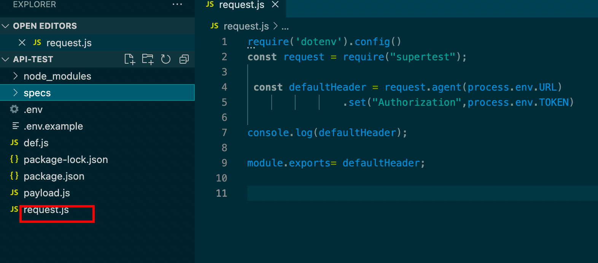
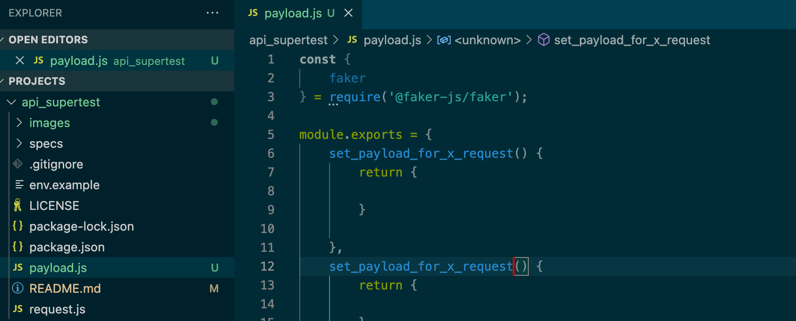
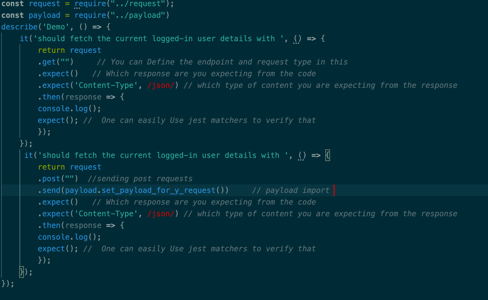
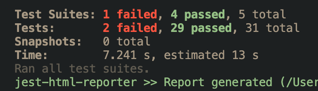

# jest_supertest
This is a generic automation test suit for api testing 
Used Framewrok
1. Jest https://jestjs.io/
2. supertest https://www.npmjs.com/package/supertest

## install
`npm install`

## Setup
Please configure the dotenv package and create a .env file from the env.example file. provide your base URL on the env file.

## Jest 
We are using Jest for maintainig the test formats. Basically We need 

**Describe** block which is a Jest method for containing one or more related tests. Every time one start writing a new suite of tests for a functionality wrap it in a block where anyone can write muliple test cases inside that.

**it** is also a block in Jest where user can write their specific functional scenario that contain the logics and methods for verifiying that particular test case is working properly or not.

## Supertest Basics
Supertest is an npm package that allows one to send HTTP request such as POST, GET, PATCH and others to HTTP server using Superagent. Supertest is built using Superagent to test the results of your HTTP requests. As we are using this framework for managing the requests We need basically different types of requests such as

**.set** method to set any default values for request.

**.get** method for getting all the values for request

**.post** method to create or generate values for request.

**.put /.patch** method to update respective values for request

**.delete** method for deleting some values for request.

## General Declarations
When anyone clone the repo, there is a file named
### request.js

It contains all the default declaration for running our test framework. As **Supertest** is required to initialised everytime we will execute the test script, so we need to require the supertest functionalities within **request.js** so that we dont need to invoke **Supertest** not more than time. For performing API testing we may need different type of default headers that will manage all the **authorization** for our tests. Default header may contains URLs, Tokens, Constants etc that are required to execute the tests. So in this case, we are using **.set** method for initializing all our constants that are required to execute the scripts.

### payload.js
For executing different API scenarios, sometimes we need to use some **.post** method to send a post request; which basically can create any object. For a neat and robust experience, user can create custom payload for different type of post requests within exportable-fucntions.

## Executing the test cases.
Defaultly We store all of our test cases inside the **specs** folder. When user will write a new test case heres some steps they need to follow for successfull execution,

1. We need to import **request.js** for initializing all the default headers.
2. We need to import the **payload.js** only for the post requests if requires.
3. We will use **describe** block of jest for describing our test events.
    
  `describe('Name of the group', () => {
 });`

4. We will use **it** block of jest which is alias of **test** block for testing out any particular sceanario. In case we need **async** requests we can declare the **it** block in async manner.

   `it('should ', () => {
    });`
5. After sending any requests, our first job is to verify the request status. For verifying the status of our request, we can use **Jest** matchers as it very much handy and will maintain a clean descrpitive manner in the script itself, such as 
   `.expect(status code that we are expecting from the request)`
6. If our status code is passed then we can now access the response from the request by using **.then** method just like,
   `.then(response => {
        console.log(response.body); 
        expect(); //  One can easily Use jest matchers to verify that
        });`

      As from the example we can see that, inside **.then** method, anyone can use **jest matchers** as well as any javascript functions for handling the response based on the test criteria. 

So in this manner one can add many test cases and assertions at once to test out API's for that.
## Run the test cases
To run all the test scripts available on the specs folder
`npm run test`

To run a single file 
`npm test filename.test.js`

If user wants to add some reporting configuration for generating dynamic report they can also use 
https://www.npmjs.com/package/jest-html-reporter
this package for generating beauitul reports. 

